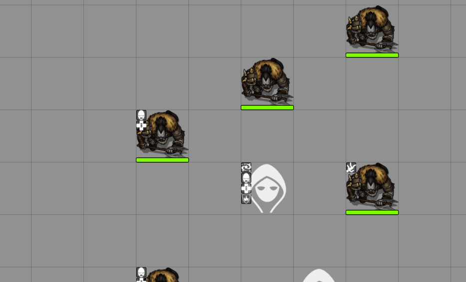

# Commander - FoundryVTT at your fingertips

Commander is a tool vaguely inspired by the likes of `Launchy` or `Wox`, and a similar feeling like `SearchAnywhere`, that lets you run commands from a shortcut-invoked prompt.

This module provides the command-line input and the API for registering new commands, and will provide some example and general-use commands.

## Bundled Commands

* Command info (i)
* Log commands the current use can use (cmd:allowed)
* Open tab (go $tab)
* Open compendium (comp $title)
* Run macro by name (m $name)
* Open character sheet by Player name (sheet:player $name)
* Open character sheet by Actor name (sheet:name $name)
* Apply active effect to selected tokens -just visual- (tae $effect)

It is not the intention of this module to provide commands specific to particular systems, but mostly the tooling and more generic commands applicable to anyone regardless of game system. If you have such a command that you want to share, [don't be afraid to open a pull request](https://github.com/ccjmk/commander/pulls)!

> For information on how to add new commands, please refer to [The Wiki](https://github.com/ccjmk/commander/wiki)

## Executing Commands

You can open the Commander widget by pressing the corresponding keybinding, configurable in-game, with the default been Ctrl+Backtick.  *(the ` right next to the 1 in english keyboards)*

Then you can start typing! Command suggestions will pop up as you type, you can auto-accept the selected suggestion with `Tab`/`Enter`, or select other suggestions using `Up` or `Down`. An `Enter` when no suggestion is selected sends the Command for execution.

## Licensing

This project is being developed under the terms of the
[LIMITED LICENSE AGREEMENT FOR MODULE DEVELOPMENT] for Foundry Virtual Tabletop.

MIT - for more info please read the LICENSE file.

[LIMITED LICENSE AGREEMENT FOR MODULE DEVELOPMENT]: https://foundryvtt.com/article/license/
